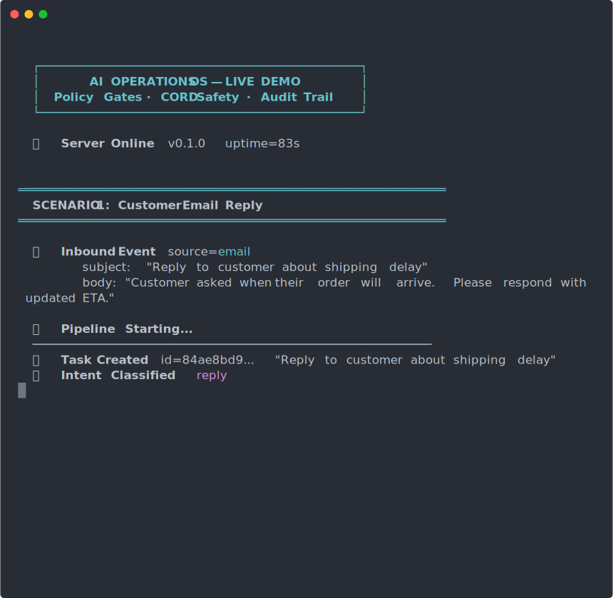

<p align="center">
  <strong>AI Operations OS</strong><br>
  <em>Autonomous business workflow orchestration with safety enforcement</em>
</p>

<p align="center">
  <a href="https://github.com/zanderone1980/ai-operations-os/actions"></a>
  <a href="https://www.npmjs.com/package/codebot-ai"></a>
  <a href="https://www.npmjs.com/package/cord-engine"></a>
  
  <a href="https://opensource.org/licenses/MIT"></a>
  <a href="https://nodejs.org">= 18"></a>
  <a href="https://www.typescriptlang.org"></a>
</p>

---

**AI Operations OS orchestrates workflows across email, calendar, social, and commerce with policy + safety gates.**

An AI agent receives an email, classifies intent, checks it against your policy rules, runs it through a safety gate, executes the action via CodeBot, and produces a cryptographically signed receipt. Every step is auditable. Every action is gated. Nothing ships without a receipt.

---

## Demo

<p align="center">
  
</p>

> 3 scenarios running through the full pipeline: email reply, calendar scheduling, and social media post. Policy gates, CORD safety scoring, and approval flow — all live.

---

## Architecture

```
 INBOUND EVENT         INTENT             POLICY             CORD              CODEBOT           RECEIPT
 ============       CLASSIFIER         EVALUATION         SAFETY GATE        EXECUTION         =========

  Gmail ──┐
  Calendar ┤        ┌──────────┐     ┌──────────────┐    ┌────────────┐    ┌────────────┐    ┌──────────┐
  X (social)┼──────>│  Classify │────>│  Policy Rules │───>│  CORD Gate │───>│  CodeBot   │───>│  Signed  │
  Shopify ──┤       │  Intent   │     │  (ops-policy) │    │  Evaluate  │    │  Execute   │    │  Receipt │
  Manual ───┘       │           │     │               │    │            │    │            │    │  (chain) │
                    │  reply    │     │  autonomous?  │    │  ALLOW     │    │  tool call │    │          │
                    │  schedule │     │  approval?    │    │  CONTAIN   │    │  via       │    │  SHA-256 │
                    │  post     │     │  block?       │    │  CHALLENGE │    │  codebot-ai│    │  HMAC    │
                    │  fulfill  │     │               │    │  BLOCK     │    │            │    │  chained │
                    │  escalate │     │               │    │            │    │            │    │          │
                    └──────────┘     └──────────────┘    └────────────┘    └────────────┘    └──────────┘

     Layer 1            Layer 2          Layer 3            Layer 4          Layer 5          Layer 6
     Ingestion          Understanding    Governance         Safety           Action           Audit
```

**Six layers. Every action passes through all six.** No shortcuts. No exceptions.

| Layer | Package | Responsibility |
|-------|---------|----------------|
| 1. Ingestion | `ops-connectors` | Normalize inbound events into Tasks |
| 2. Understanding | `ops-core` | Intent classification (heuristic; optional LLM via OpenAI/Anthropic/Ollama) |
| 3. Governance | `ops-policy` | Owner-defined rules and approval routing |
| 4. Safety | `cord-adapter` | CORD risk scoring (ALLOW / CONTAIN / CHALLENGE / BLOCK) |
| 5. Action | `codebot-adapter` | Map workflow steps to CodeBot tool calls |
| 6. Audit | `shared-types` | Hash-chained, HMAC-signed ActionReceipts |

---

## MVP Scope

The initial release ships with four connectors covering the daily operational surface area of a solo founder or small team.

### Connectors

| Connector | Status | Notes |
|-----------|--------|-------|
| Gmail | MVP | Read, reply, draft, send |
| Google Calendar | MVP | Create, update, cancel events |
| X (Twitter) | MVP | Post, reply, schedule |
| Shopify | MVP | List orders, order details, products, customers |

### Autonomy Matrix

What runs on its own vs. what asks you first.

| Action | Mode | CORD Gate |
|--------|------|-----------|
| Read email | **Autonomous** | ALLOW (readonly) |
| Draft reply to known contact | **Autonomous** | ALLOW (score < 20) |
| Send reply to known contact | **Approval required** | CONTAIN (score 20-49) |
| Send email to new recipient | **Approval required** | CHALLENGE (score 50-79) |
| Delete email | **Blocked** | BLOCK (score 80+, destructive) |
| Read calendar | **Autonomous** | ALLOW (readonly) |
| Accept meeting from known org | **Autonomous** | ALLOW (score < 20) |
| Create event with external attendees | **Approval required** | CONTAIN (score 20-49) |
| Cancel event | **Approval required** | CHALLENGE (score 50-79) |
| Post to X (draft) | **Autonomous** | ALLOW (draft only) |
| Publish post to X | **Approval required** | CONTAIN (publication) |
| Financial operations | **Blocked** | BLOCK (hardBlock: true) |

---

## Quick Start

### Prerequisites

- Node.js >= 18
- npm >= 10

### Install and build

```bash
git clone https://github.com/zanderone1980/ai-operations-os.git
cd ai-operations-os
npm install
npm run build
```

### Start the API server

```bash
npm run dev --workspace=apps/ops-api
```

### Health check

```bash
curl http://localhost:3000/health
```

Expected response:

```json
{
  "status": "ok",
  "version": "0.1.0",
  "uptime": 1.234
}
```

### Run tests

```bash
npm test
```

### Environment variables

Copy the example env and fill in your credentials:

```bash
cp .env.example .env
```

| Variable | Required | Description |
|----------|----------|-------------|
| `GMAIL_CLIENT_ID` | For Gmail | Google OAuth client ID |
| `GMAIL_CLIENT_SECRET` | For Gmail | Google OAuth client secret |
| `CALENDAR_API_KEY` | For Calendar | Google Calendar API key |
| `X_API_KEY` | For X | X API bearer token |
| `CORD_HMAC_KEY` | Yes | HMAC key for receipt signing |
| `POLICY_VERSION` | No | Policy version identifier (default: `v1`) |

---

## Integration Contracts

These are the core interfaces that adapters implement. If you are building a new connector or integrating AI Operations OS into your stack, these are the contracts you code against.

### Task (universal work item)

Every inbound event -- email, calendar invite, social mention, store order -- becomes a `Task`. This is the lingua franca of the system.

```typescript
type TaskSource = 'email' | 'calendar' | 'social' | 'store' | 'manual';

type TaskIntent =
  | 'reply'
  | 'schedule'
  | 'post'
  | 'fulfill'
  | 'escalate'
  | 'ignore'
  | 'unknown';

type TaskPriority = 'urgent' | 'high' | 'normal' | 'low';

type TaskStatus =
  | 'pending'
  | 'planned'
  | 'running'
  | 'awaiting_approval'
  | 'completed'
  | 'failed';

interface Task {
  id: string;                          // UUID v4
  source: TaskSource;                  // Where this task originated
  sourceId?: string;                   // External ID (Gmail messageId, etc.)
  intent: TaskIntent;                  // Classified intent (heuristic or LLM)
  title: string;                       // Human-readable title
  body?: string;                       // Full content / body text
  priority: TaskPriority;              // Urgency classification
  status: TaskStatus;                  // Lifecycle state
  owner?: string;                      // Assignee identifier
  dueAt?: string;                      // ISO 8601
  createdAt: string;                   // ISO 8601
  updatedAt: string;                   // ISO 8601
  metadata: Record<string, unknown>;   // Source-specific data
}
```

### WorkflowStep (execution unit)

A Task triggers a `WorkflowRun`. Each run has ordered `WorkflowStep`s that execute through connectors.

```typescript
type CordDecision = 'ALLOW' | 'CONTAIN' | 'CHALLENGE' | 'BLOCK';

type StepStatus = 'pending' | 'running' | 'completed' | 'failed' | 'blocked' | 'approved';

interface WorkflowStep {
  id: string;                          // UUID v4
  connector: string;                   // Which connector handles this step
  operation: string;                   // e.g., 'send', 'create_event', 'post'
  input: Record<string, unknown>;      // Input data for the operation
  output?: Record<string, unknown>;    // Populated after execution
  status: StepStatus;                  // Current step state
  cordDecision?: CordDecision;         // CORD safety decision
  cordScore?: number;                  // Risk score (0-99)
  error?: string;                      // Error message if failed
  durationMs?: number;                 // Execution time in ms
}
```

### ActionReceipt (signed proof of execution)

Every executed action produces a receipt. Receipts are hash-chained for tamper detection. Auditors can verify the entire chain independently.

```typescript
interface ActionReceipt {
  id: string;                          // UUID v4
  actionId: string;                    // The action this receipt covers
  policyVersion: string;               // Policy version during evaluation
  cordDecision: string;                // CORD decision for this action
  cordScore: number;                   // Risk score (0-99)
  cordReasons: string[];               // Risk reasons
  input: Record<string, unknown>;      // Sanitized input (secrets redacted)
  output?: Record<string, unknown>;    // Output summary
  timestamp: string;                   // ISO 8601
  hash: string;                        // SHA-256 content hash
  signature: string;                   // HMAC-SHA256 signature
  prevHash: string;                    // Previous receipt hash (chain link)
}
```

Receipt chain verification: each receipt's `prevHash` points to the previous receipt's `hash`. The first receipt in the chain uses the genesis hash `"genesis"`. The chain is verified by recomputing each hash and validating each HMAC signature.

### CodeBotAdapter

Bridges workflow steps to [codebot-ai](https://www.npmjs.com/package/codebot-ai) tool calls. Degrades gracefully to mock execution when `codebot-ai` is not installed.

```typescript
class CodeBotAdapter {
  /** Execute a workflow step via CodeBot tool invocation. */
  async executeStep(step: WorkflowStep): Promise<StepResult>;

  /** Check if codebot-ai is available. */
  isAvailable(): boolean;
}

interface StepResult {
  success: boolean;
  output: Record<string, unknown>;
  durationMs: number;
  error?: string;
  mock: boolean;                       // true if codebot-ai not installed
}
```

**Operation-to-tool mapping:**

| Connector Operation | CodeBot Tool |
|---------------------|-------------|
| `send`, `reply`, `forward` | `messaging.*` |
| `read`, `list`, `search`, `get` | `data.*` |
| `create_event`, `update_event`, `cancel_event` | `calendar.*` |
| `post`, `tweet` | `social.publish` |
| `delete`, `remove`, `archive` | `resource.*` |
| `refund`, `charge` | `commerce.*` |
| `transfer` | `finance.transfer` |

### CordSafetyGate

Wraps [cord-engine](https://www.npmjs.com/package/cord-engine) to evaluate proposed actions against safety policies before execution. Degrades to ALLOW-all when `cord-engine` is not installed.

```typescript
class CordSafetyGate {
  /** Evaluate a proposed action through CORD safety analysis. */
  evaluateAction(
    connector: string,
    operation: string,
    input: Record<string, unknown>,
  ): SafetyResult;

  /** Check if cord-engine is available. */
  isAvailable(): boolean;
}

interface SafetyResult {
  decision: CordDecision;             // ALLOW | CONTAIN | CHALLENGE | BLOCK
  score: number;                      // 0-99 risk score
  reasons: string[];                  // Human-readable risk reasons
  hardBlock: boolean;                 // true = cannot be overridden
}
```

**Operation-to-CORD-tool mapping:**

| Operation Category | CORD Tool Type |
|--------------------|----------------|
| `send`, `reply`, `forward` | `communication` |
| `post`, `tweet` | `publication` |
| `delete`, `remove`, `archive` | `destructive` |
| `create_event`, `update_event`, `cancel_event` | `scheduling` |
| `refund`, `charge`, `transfer` | `financial` |
| `read`, `list`, `search`, `get` | `readonly` |

---

## Project Structure

```
ai-operations-os/
├── apps/
│   ├── ops-api/               # HTTP/SSE API server (30 routes, zero deps)
│   ├── ops-web/               # Web dashboard (approval inbox, pipeline viz)
│   └── ops-worker/            # Background job processor + pipeline engine
│
├── packages/
│   ├── shared-types/          # Task, WorkflowStep, ActionReceipt types + JSON Schemas
│   ├── ops-core/              # Intent classifier (heuristic + LLM), workflow engine
│   ├── ops-policy/            # Policy rules, autonomy levels, budget tracking
│   ├── ops-connectors/        # Gmail, Calendar, X, Shopify connector adapters
│   ├── ops-storage/           # SQLite database layer (WAL mode, indexed)
│   ├── codebot-adapter/       # Bridge to codebot-ai + receipt chain builder
│   └── cord-adapter/          # Bridge to cord-engine safety evaluation
│
├── scripts/
│   └── demo.ts                # Pipeline demo script (3 scenarios + receipt chain)
│
├── package.json               # Workspace root (npm workspaces + Turborepo)
├── turbo.json                 # Turborepo pipeline configuration
└── tsconfig.json              # Shared TypeScript config
```

**10 packages.** 3 apps, 7 libraries. Managed with npm workspaces and built with Turborepo.

---

## Why Now

### The problem

Every founder, operator, and small team runs the same loop: check email, triage, respond, update calendar, post updates, process orders, repeat. The tools exist. The integrations exist. But the orchestration layer -- the thing that ties intent to action to audit trail -- does not.

Current solutions fall into two buckets:

1. **Zapier-style automation**: Trigger-action pairs with no understanding, no safety, no audit trail. Fine for simple webhooks. Breaks down when you need judgment calls.
2. **Full AI agents**: Black boxes that do things on your behalf with no policy gates, no approval workflows, no receipts. Great demos. Terrifying in production.

### The gap

There is no system that combines:

- **Intent classification** — heuristic by default, optional LLM upgrade (understanding what needs to happen)
- Owner-defined **policy rules** (deciding what is allowed to happen autonomously)
- Real-time **safety scoring** (catching risky actions before they execute)
- Cryptographically signed **audit receipts** (proving exactly what happened and why)

AI Operations OS fills that gap.

### Who this is for

- **Solo founders** managing email, calendar, and social across multiple projects
- **Small teams** that need operational leverage without hiring an ops person
- **Agencies** handling client communication across channels
- **Anyone** who wants AI automation they can actually trust and audit

### What ships

This is not a pitch deck. This is a working monorepo with real TypeScript, real types, real adapters, and real safety gates. The MVP covers Gmail, Google Calendar, and X. More connectors are coming. The architecture is designed to scale to any integration that can be expressed as a connector operation.

---

## Contributing

This project is in active development. Issues and pull requests are welcome.

```bash
# Fork, clone, install
npm install

# Run all tests
npm test

# Build all packages
npm run build

# Lint
npm run lint
```

---

## License

MIT -- see [LICENSE](LICENSE) for details.

---

<p align="center">
  Built by <a href="https://artificialpersistence.com">Alex Pinkevich</a> at <strong>Ascendral / ZanderPink Design LLC</strong><br>
  <a href="https://github.com/zanderone1980">GitHub</a> · <a href="https://x.com/alexpinkone">X @alexpinkone</a> · <a href="https://www.npmjs.com/package/codebot-ai">codebot-ai</a> · <a href="https://www.npmjs.com/package/cord-engine">cord-engine</a>
</p>
